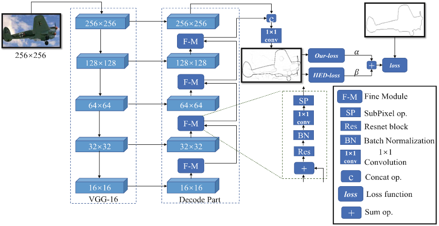

# Multi-Scale Feature Decode and Fuse Model for Boundary Detection

It is the caffe implementation of MSDF model based on "Multi-scale feature decode and fuse model with crf layer for boundary detection." and "Learning Deep Structured Multi-Scale Features for crisp and object occlusion edge detection. " by Zihao et al.

## The architecture of MSDF

{:zoom="70%"}

## Citation
If you find Shift-MIL pooling application is useful in your research, please consider to cite:

	@inproceedings{dong2018multi-scale,
	  title={Multi-scale feature decode and fuse model with crf layer for boundary detection},
	  author={Dong, Zihao et.al},
	  booktitle={International Conference on Neural Information Processing},
	  pages={28--40},
	  year={2018}
	}
 
 	@inproceedings{dong2019learning,
	  title={Learning Deep Structured Multi-Scale Features for crisp and object occlusion edge detection},
	  author={Dong, Zihao et.al},
	  booktitle={International Conference on Artificial Neural Networks},
	  pages={253--266},
	  year={2019}
	}
  

## Other Re-implementation
...
